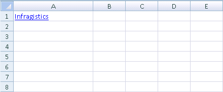

////

|metadata|
{
    "name": "excelengine-adding-a-hyperlink-to-a-cell-in-an-excel-file",
    "controlName": ["Infragistics Excel Engine"],
    "tags": [],
    "guid": "{63A1BBC2-3892-45C4-B7CA-86A873ADE21F}",  
    "buildFlags": [],
    "createdOn": "2009-06-02T10:43:07Z"
}
|metadata|
////

= Adding a Hyperlink to a cell in an Excel file

This topic shows you how to add a hyperlink to a cell in a Microsoft® Excel™ file using the  pick:[win-forms=" link:{ApiPlatform}documents.excel{ApiVersion}~infragistics.documents.excel.worksheetcell.html[WorksheetCell]"]pick:[asp-net=" link:{ApiPlatform}webui.documents.excel{ApiVersion}~infragistics.documents.excel.worksheetcell.html[WorksheetCell]"]  object’s  pick:[win-forms=" link:{ApiPlatform}documents.excel{ApiVersion}~infragistics.documents.excel.worksheetcell~applyformula.html[ApplyFormula]"]pick:[asp-net=" link:{ApiPlatform}webui.documents.excel{ApiVersion}~infragistics.documents.excel.worksheetcell~applyformula.html[ApplyFormula]"]  method. The following code creates an Excel file with a hyperlink in cell 0 of the worksheet by using the intrinsic Excel HYPERLINK formula.

Before you start writing any code, you should place using/imports directives in your code-behind so you don't need to always type out a member's fully qualified name.

*In Visual Basic:*

----
Imports Infragistics.Documents.Excel
----

*In C#:*

----
using Infragistics.Documents.Excel;
----

*In Visual Basic:*

----
'Create an Excel File 
 Dim s As String = "C:\theFile.xls"
 'Create a Workbook 
 Dim w As New Workbook()
 'Add a new worksheet to the Workbook 
 Dim ws As Worksheet = w.Worksheets.Add("New")
 'Create Hyperlink in a Worksheet cell 
ws.Rows(0).Cells(0).ApplyFormula("=HYPERLINK(""http://www.infragistics.com"",""Infragistics"")")
 w.Save(s)
----

*In C#:*

----
//Create an Excel File
 string s = @" C:\theFile.xls";
//Create a Workbook
 Workbook w = new Workbook();
//Add a new worksheet to the Workbook
Worksheet ws = w.Worksheets.Add("New");
 //Create Hyperlink in a Worksheet cell
ws.Rows[0].Cells[0].ApplyFormula(@"=HYPERLINK(""http://www.infragistics.com"",""Infragistics"")");
 w.Save(s);
----

*Result:*

