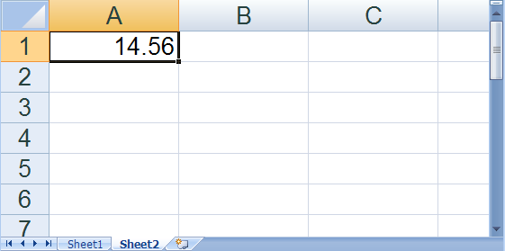

////

|metadata|
{
    "name": "excelengine-create-a-workbook",
    "controlName": ["Infragistics Excel Engine"],
    "tags": [],
    "guid": "{B75FEC1B-2CB3-416C-8011-0ADC32B64010}",  
    "buildFlags": [],
    "createdOn": "2007-04-05T08:22:09Z"
}
|metadata|
////

= Create a Workbook

Before you can take advantage of the features in the Excel assembly, you will need to create a  pick:[win-forms=" link:{ApiPlatform}documents.excel{ApiVersion}~infragistics.documents.excel.workbook.html[Workbook]"]   pick:[asp-net=" link:{ApiPlatform}webui.documents.excel{ApiVersion}~infragistics.documents.excel.workbook.html[Workbook]"]   pick:[win-forms-old=" link:{ApiPlatform}documents.excel{ApiVersion}~infragistics.documents.excel.workbook.html[Workbook]"]   pick:[aspnet-old=" link:{ApiPlatform}webui.documents.excel{ApiVersion}~infragistics.documents.excel.workbook.html[Workbook]"]  object. You can do this by either reading an existing Microsoft® Excel® file, as explained in the How Do I... topic: link:excelengine-read-an-excel-file-into-a-workbook.html[Read an Excel File into a Workbook] or you can create a blank workbook. When you create a blank workbook, before writing it to a file, you must add at least one worksheet. You can also set various display and print options on the workbook and worksheets.

The following code demonstrates how to create a blank workbook, set a few properties, and add some worksheets.

*In Visual Basic:*

----
' Create a new workbook
Dim workbook As New Infragistics.Documents.Excel.Workbook()
' Show only the vertical scroll bar
workbook.WindowOptions.ScrollBars = Infragistics.Documents.Excel.ScrollBars.Vertical
' Create two worksheets for the workbook
Dim worksheet1 As Infragistics.Documents.Excel.Worksheet = _
  workbook.Worksheets.Add("Sheet1")
Dim worksheet2 As Infragistics.Documents.Excel.Worksheet = _
  workbook.Worksheets.Add("Sheet2")
' Set the value of one of the cells
worksheet2.Rows.Item(0).Cells.Item(0).Value = 14.56
' Zoom in to double the normal viewing size on Sheet2
worksheet2.DisplayOptions.MagnificationInNormalView = 200
' Make Sheet2 the selected worksheet
workbook.WindowOptions.SelectedWorksheet = worksheet2
----

*In C#:*

----
// Create a new workbook
Infragistics.Documents.Excel.Workbook workbook = new Infragistics.Documents.Excel.Workbook();
// Show only the vertical scroll bar
workbook.WindowOptions.ScrollBars = Infragistics.Documents.Excel.ScrollBars.Vertical;
// Create two worksheets for the workbook
Infragistics.Documents.Excel.Worksheet worksheet1 = workbook.Worksheets.Add( "Sheet1" );
Infragistics.Documents.Excel.Worksheet worksheet2 = workbook.Worksheets.Add( "Sheet2" );
// Set the value of one of the cells
worksheet2.Rows[0].Cells[0].Value = 14.56;
// Zoom in to double the normal viewing size on Sheet2
worksheet2.DisplayOptions.MagnificationInNormalView = 200;
// Make Sheet2 the selected worksheet
workbook.WindowOptions.SelectedWorksheet = worksheet2;
----

