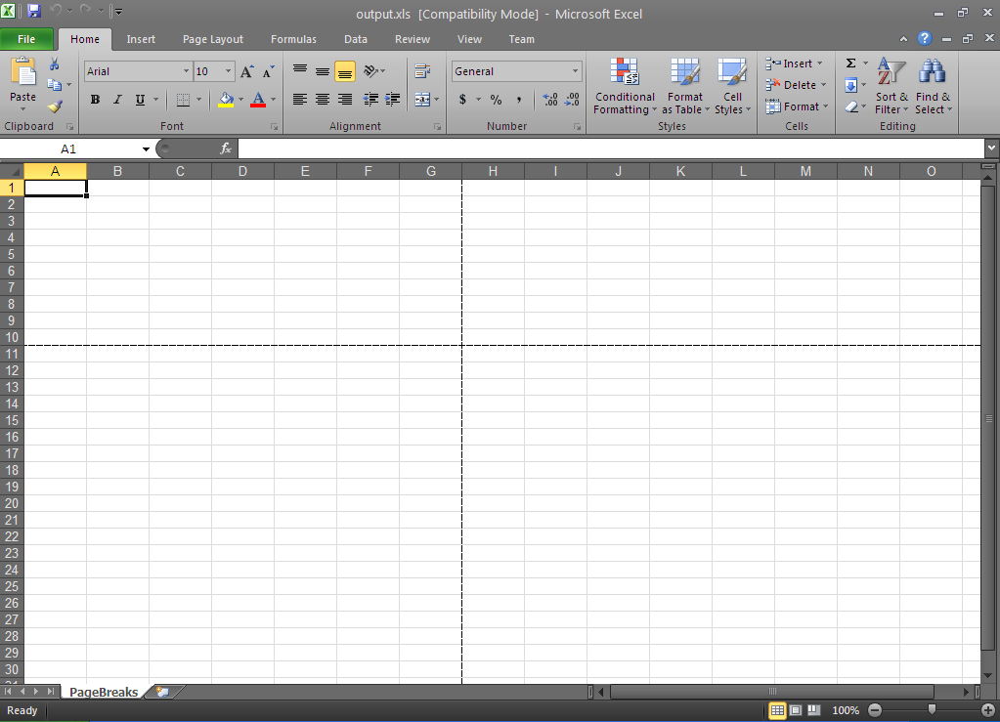

////

|metadata|
{
    "name": "excelengine-page-breaks",
    "controlName": ["Infragistics Excel Engine"],
    "tags": [],
    "guid": "cfc30d90-7cfc-43e0-b939-bf4e3d162ccc",  
    "buildFlags": [],
    "createdOn": "2011-10-10T13:55:17.8926395Z"
}
|metadata|
////

= Page Breaks

This topic outlines the page break support in the Infragistics Excel Engine and provides a code example demonstrating usage.

The topic is organized as follows:

* <<One,Introduction>>
* <<Two,Creating Page Breaks>>

** <<TwoOne,Overview>>
** <<TwoTwo,Preview>>
** <<TwoThree,Code Example>>

* <<Three,Related Topics>>

[[One]]
== Introduction

Infragistics Excel Engine allows you to insert vertical and horizontal page breaks in the worksheet or any print area on the worksheet, mimicking the page break functionality found in Microsoft Excel.

When printing the worksheet, the page break will denote the places where new printed pages should begin. In addition, if any custom views are created, they will store page break information. Therefore, different page breaks can be used with different custom views.

[[Two]]
== Creating Page Breaks

[[TwoOne]]
== Overview

The code example below creates two page breaks – vertical and horizontal – using cell H11 as a reference point for the breaks – using a workbook with the following parameters:

* Workbook named: output.xls
* Worksheet named: PageBreaks
* Horizontal and vertical page break at: H11

[[TwoTwo]]
== Preview

Following is a preview of the final result.

Figure 1: Microsoft Excel showing the final result of the code example: two page breaks

[[TwoThree]]
== Code Example

*In C#:*

----
// Create the workbook with one worksheet called PageBreaks
Infragistics.Documents.Excel.Workbook workbook = new Infragistics.Documents.Excel.Workbook();
Infragistics.Documents.Excel.Worksheet worksheet = workbook.Worksheets.Add("PageBreaks");
// Create a cell reference to cell H11 (future horizontal & vertical page break)
WorksheetCell wsc = worksheet.GetCell("H11");
// Add a horizontal & vertical page break at cell H11
worksheet.PrintOptions.InsertPageBreak(wsc);
try
{
    // Save the created workbook
    workbook.Save("output.xls");
    // Open the workbook to display the results
    System.Diagnostics.Process.Start("output.xls");
}
catch
{
    MessageBox.Show("If the workbook is open, please close it before saving.", "Save Error",
        MessageBoxButtons.OK, MessageBoxIcon.Stop);
}
----

*In Visual Basic:*

----
' Create the workbook with one worksheet called PageBreaks
Dim workbook As New Infragistics.Documents.Excel.Workbook()
Dim worksheet As Infragistics.Documents.Excel.Worksheet = workbook.Worksheets.Add("PageBreaks")
' Create a cell reference to cell H11 (future horizontal & vertical page break)
Dim wsc As WorksheetCell = worksheet.GetCell("H11")
' Add a horizontal & vertical page break at cell H11
worksheet.PrintOptions.InsertPageBreak(wsc)
Try
    ' Save the created workbook
    workbook.Save("output.xls")
    ' Open the workbook to display the results
    System.Diagnostics.Process.Start("output.xls")
Catch
    MessageBox.Show("If the workbook is open, please close it before saving.", "Save Error", MessageBoxButtons.OK, MessageBoxIcon.[Stop])
End Try
----

[[Three]]
== Related Topics

* link:excelengine-print-areas.html[Print Areas]
* link:excelengine-accessing-cells-and-regions-by-their-reference-strings.html[Accessing Cells and Regions by their Reference Strings]
* link:excelengine-create-a-workbook.html[Create a Workbook]
* link:excelengine-write-a-workbook-to-an-excel-file.html[Write a Workbook to an Excel File]