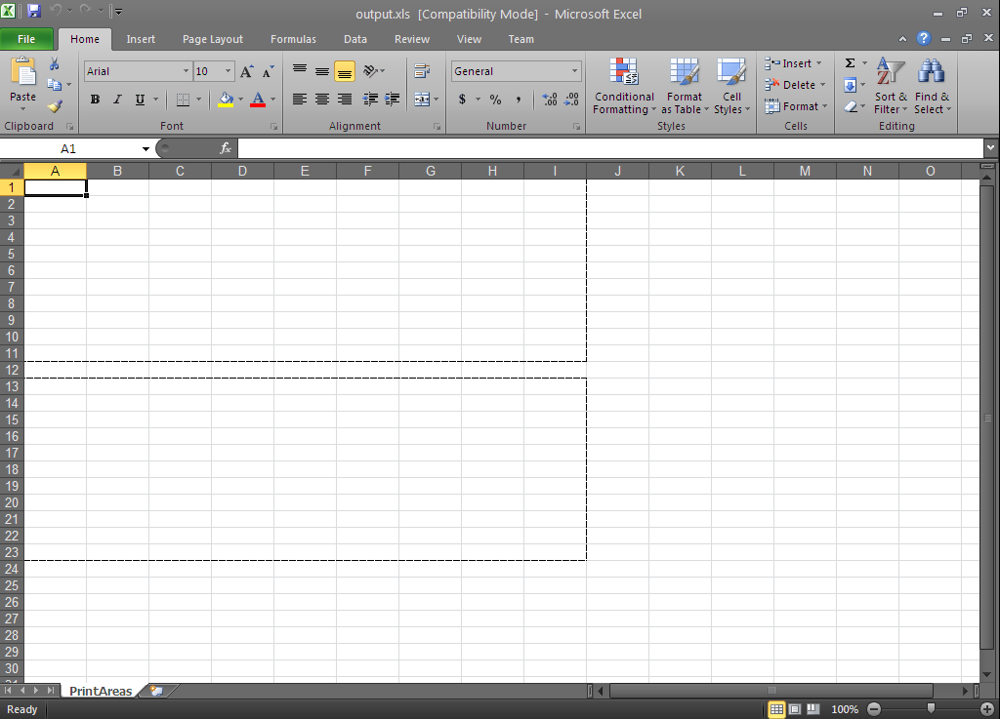

////

|metadata|
{
    "name": "excelengine-print-areas",
    "controlName": ["Infragistics Excel Engine"],
    "tags": [],
    "guid": "faba24ff-51bd-4ec3-a56f-f5e7d2b1d24c",  
    "buildFlags": [],
    "createdOn": "2011-10-10T14:03:38.6026395Z"
}
|metadata|
////

= Print Areas

This topic outlines the print areas support in the Infragistics Excel Engine and provides a code example demonstrating usage.

The topic is organized as follows:

* <<One,Introduction>>
* <<Two,Creating Print Areas>>

** <<TwoOne,Overview>>
** <<TwoTwo,Preview>>
** <<TwoThree,Code Example>>

* <<Three,Related Topics>>

[[One]]
== Introduction

Infragistics Excel Engine allows you to set one or more rectangular regions (which do no overlap) as print areas, mimicking the print area functionality found in Microsoft Excel. These areas will be placed on their own pages when the worksheet is printed. In addition, any page breaks inserted in the print areas will only apply to that specific print area.

.Note
[NOTE]
====
*Note:*

When configuring print areas, the following requirements must be met, otherwise an exception will be thrown:

. The print areas collection on the worksheet can contain regions only from the worksheet to which the print options belong
. The regions cannot overlap.
====

[[Two]]
== Creating Print Areas

[[TwoOne]]
== Overview

The code example below creates two print areas using a workbook with the following parameters:

* Workbook named: output.xls
* Worksheet named: PrintAreas
* Print area 1: A1:I11
* Print area 2: A13:I23

[[TwoTwo]]
== Preview

Following is a preview of the final result.

Figure 1: Microsoft Excel showing the final result of the code example: two print areas

[[TwoThree]]
== Code Example

*In C#:*

----
// Create the workbook with one worksheet called PrintAreas
Infragistics.Documents.Excel.Workbook workbook = new Infragistics.Documents.Excel.Workbook();
Infragistics.Documents.Excel.Worksheet worksheet = workbook.Worksheets.Add("PrintAreas");
// Create worksheet region to define a print area: A1:I11
WorksheetRegion wsr_one = worksheet.GetRegion("A1:I11");
// Create another worksheet region to define a print area: A13:I23
WorksheetRegion wsr_two = worksheet.GetRegion("A13:I23");
// Add the print area regions to the worksheet
worksheet.PrintOptions.PrintAreas.Add(wsr_one);
worksheet.PrintOptions.PrintAreas.Add(wsr_two);
try
{
    // Save the created workbook
    workbook.Save("output.xls");
    // Open the workbook to display the results
    System.Diagnostics.Process.Start("output.xls");
}
catch
{
    MessageBox.Show("If the workbook is open, please close it before saving.", "Save Error",
        MessageBoxButtons.OK, MessageBoxIcon.Stop);
}
----

*In Visual Basic:*

----
' Create the workbook with one worksheet called PrintAreas
Dim workbook As New Infragistics.Documents.Excel.Workbook()
Dim worksheet As Infragistics.Documents.Excel.Worksheet = workbook.Worksheets.Add("PrintAreas")
' Create worksheet region to define a print area: A1:I11
Dim wsr_one As WorksheetRegion = worksheet.GetRegion("A1:I11")
' Create another worksheet region to define a print area: A13:I23
Dim wsr_two As WorksheetRegion = worksheet.GetRegion("A13:I23")
' Add the print area regions to the worksheet
worksheet.PrintOptions.PrintAreas.Add(wsr_one)
worksheet.PrintOptions.PrintAreas.Add(wsr_two)
Try
    ' Save the created workbook
    workbook.Save("output.xls")
    ' Open the workbook to display the results
    System.Diagnostics.Process.Start("output.xls")
Catch
    MessageBox.Show("If the workbook is open, please close it before saving.", "Save Error", MessageBoxButtons.OK, MessageBoxIcon.[Stop])
End Try
----

[[Three]]
== Related Topics

* link:excelengine-page-breaks.html[Page Breaks]
* link:excelengine-accessing-cells-and-regions-by-their-reference-strings.html[Accessing Cells and Regions by their Reference Strings]
* link:excelengine-create-a-workbook.html[Create a Workbook]
* link:excelengine-write-a-workbook-to-an-excel-file.html[Write a Workbook to an Excel File]